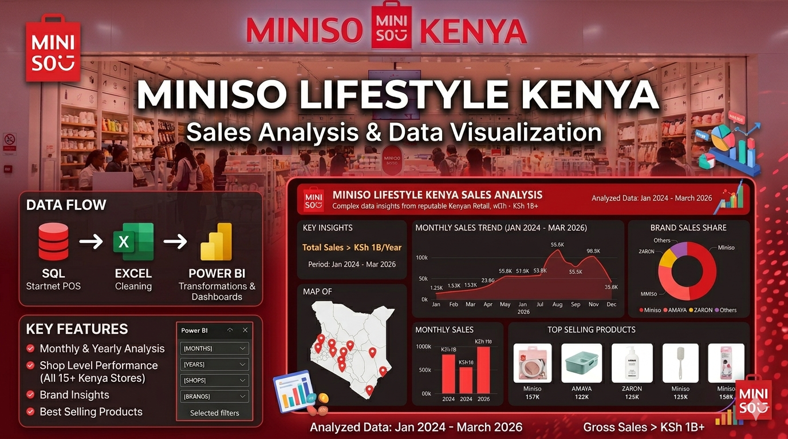

  

# MINISO LIFESTYLE KE Sales Analytics Dashboard (Power BI)
A data-driven exploration of retail performance across multiple Miniso stores, transforming raw POS data into interactive insights that support smarter business decisions.

**Excel Automation, SQL querying & Power BI Dashboard Project**

---

## 📌 Project Overview

The **Miniso Lifestyle KE Project** is a complete financial tracking and automation solution that analyzes sales data from Miniso lifestyle stores spanning January 2024 to March 2026.
This Power BI project provides a comprehensive analysis of sales performance with the dashboard tracking business health, offering granular insights into store-level performance, brand distribution, and product trends.It turns scattered transactional data into a clear, interactive story of performance, trends, and opportunities.

The goal of this project was to transform raw POS data into actionable intelligence, allowing stakeholders to identify high-performing locations and optimize inventory based on seasonal trends. Consider the dashboard **a control panel for retail intelligence.**

---

## ⚙️ Data Pipeline
The journey of the data is just as important as the visuals:

🔹 Data Source

Extracted from Startnet POS system using SQL queries.

Includes:

Sales transactions
Product details
Store-level data
Brand categorization
🔹 Data Cleaning & Preparation

Before stepping into Power BI, the data went through refinement:

Removed inconsistencies using:
CLEAN() – to strip non-printable characters
TRIM() – to eliminate excess spaces
Standardized fields (dates, product names, brands)
Structured data for relational modeling
🔹 Data Modeling

Built relationships across:

*Stores

*Products

*Brands

*Time (Calendar table)

---

## 🏗 System Architecture

### Backend: Microsoft Excel

Used for:

* Data storage and management
* Automation and calculations
* Lookup relationships across sheets
* Data validation and integrity
* Pivot table reporting

### Frontend: Power BI

Used for:

* Interactive dashboards
* KPI reporting
* Portfolio performance analysis
* Dynamic slicers for filtering

---

## 📂 Excel Workbook Structure

The Excel file is built with a relational structure and automated logic across multiple sheets.

### Clients Sheet

* Stores all onboarded clients
* Only onboarded clients can receive loans
* Acts as the master client registry

### Loans Sheet

* Records all issued loans
* Client selection via automated lookup
* Automatically calculates:

  * Interest
  * Total payable
  * Due dates
  * Loan status

### Payments Sheet

* Records all repayments
* Automatically links payments to loan IDs
* Updates balances in real-time

### Records Sheet

* Central transaction ledger
* Stores both loan and payment transactions
* Used as the main reporting table

---

## 🔄 Automation Features

* Automated interest calculations
* Real-time balance updates after each payment
* Auto-classification of loan status:

  * Pending
  * Settled
  * Bad Debt
* Automated lookups across all sheets
* No manual recalculations required

---

## 🛡 Data Validation & Integrity

To ensure clean and accurate data entry, the system includes:

* Dropdown lists for client names and loan IDs
* Numeric validation for financial fields
* Date validation for transaction records
* Duplicate prevention logic
* Controlled text inputs

This prevents data entry errors and ensures system reliability.

---

## 📊 Excel Pivot Reports

The workbook includes two automated pivot tables:

### Loan Portfolio Summary

* Total loans issued
* Total amount disbursed
* Interest earned
* Outstanding balances

### Repayment & Debt Analysis

* Total repayments
* Pending debts
* Settled accounts
* Bad debts

These pivot tables serve as the data source for Power BI.

---

## 📈 Power BI Dashboard

The Power BI dashboard connects directly to the Excel file and provides:

### Key Metrics

* Total Loans Issued
* Total Amount Repaid
* Outstanding Balances
* Pending Debts
* Settled Loans
* Bad Debts
* Interest Earned

### Visuals

* KPI cards
* Bar charts
* Pie charts
* Trend analysis
* Client performance tables

### Interactive Slicers

* Filter by client
* Filter by loan status
* Filter by loan ID
* Filter by date

All visuals respond dynamically to slicer selections.

---

## 💼 Business Use Case

This project simulates how a real lending institution would:

* Onboard clients
* Issue loans
* Track repayments
* Manage debt portfolios
* Monitor financial performance
* Make data-driven decisions

---

## 🧠 Skills Demonstrated

* Excel automation
* Advanced formulas
* Lookup functions
* Data validation
* Financial modeling
* Pivot tables
* Power BI dashboard design
* Business intelligence reporting

---

## 🚀 How to Use

1. Add new clients in the **Clients Sheet**
2. Issue loans from the **Loans Sheet**
3. Record repayments in the **Payments Sheet**
4. Balances and loan status update automatically
5. Refresh Power BI to view updated analytics

---

## 🔧 Tools Used

* Microsoft Excel
* Power BI Desktop
* Pivot Tables
* Power Query
* DAX

---

## 📚 Data Dictionary

---

## 📚 Sample Data Sets

    

---
## 📚 Dashboard - PowerBI
* PAGE 1

* PAGE 2

* PAGE 3

---

## 📜 Disclaimer

This project is for demonstration and portfolio purposes only.
Flash Logistics is a fictional company created for learning and development.

---

## 👤 Author

**Elvis Mbaya**
Data Analyst
Excel Automation | Power BI | Business Intelligence

---

## ⭐ Portfolio Value

If you find this project useful, feel free to star ⭐ the repository.
